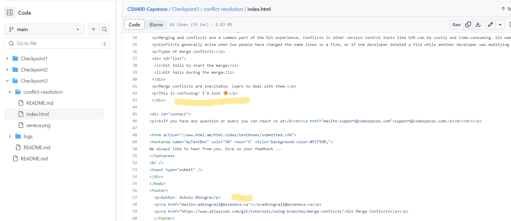
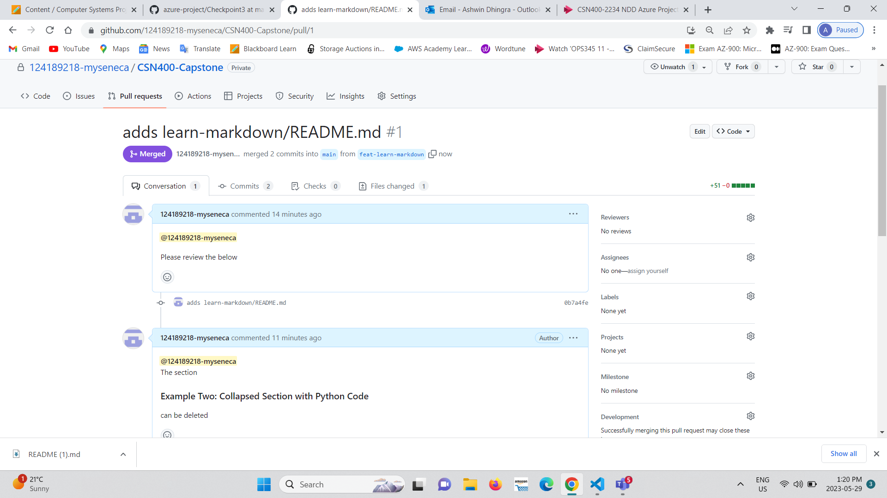

# Checkpoint3 Submission

- **COURSE INFORMATION: CSN400NDD**
- **STUDENT’S NAME: Ashwin Dhingra**
- **STUDENT'S NUMBER: 124189218**
- **GITHUB USER ID: 124189218-myseneca**
- **TEACHER’S NAME: Atoosa Nasiri**

## Table of Contents
1. [Part A - Manage Conflicts - Overwrite Remote Changes](#Part-A---Manage-Conflicts---Overwrite-Remote-Changes)
2. [Part B - Manage Conflicts - Reset Local Commit Head](#Part-B---Manage-Conflicts---Reset-Local-Commit-Head)
3. [Part C - Manage Conflicts - Merge Editor](#Part-C---Manage-Conflicts---Merge-Editor)
4. [Part D - Collaboration - Creating Pull Request](#Part-D---Collaboration---Creating-Pull-Request)

##  Part A - Manage Conflicts - Overwrite Remote Changes

### What is the color of the text after you forcefully overwrite remote with local changes?

#### Answer - The color is green.
# 
##  Part B - Manage Conflicts - Reset Local Commit Head

### What is the color of the text after you forcefully overwrite remote with local changes?

#### Answer - The color is darkolivegreen
#
##  Part C - Manage Conflicts - Merge Editor

### Screenshot of the paragraphs

#

## Part D - Collaboration - Creating Pull Request

### Take a screenshot of your Pull Request

