# Checkpoint4 Submission

- **COURSE INFORMATION: CSN400NDD**
- **STUDENT’S NAME: Ashwin Dhingra**
- **STUDENT'S NUMBER: 124189218**
- **GITHUB USER ID: 124189218-myseneca**
- **TEACHER’S NAME: Atoosa Nasiri**

### Table of Contents
1. [Part A - Working with Docker Desktop](#Part-A---Working-with-Docker-Desktop)
2. [Part B - Run Your own container](#Part-B---Run-Your-own-container)
3. [Part C - Run Docker Hub Image](#Part-C---Run-Docker-Hub-Image)
4. [Part D - Publish your images](#Part-D---Publish-your-images)

##  Part A - Working with Docker Desktop
#

 Step1

 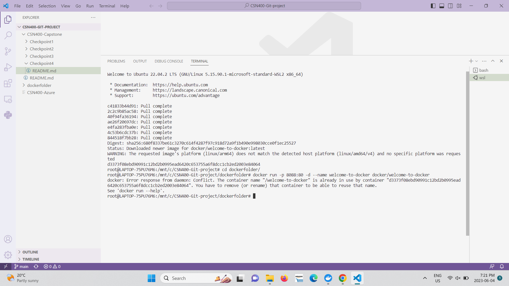

 Step-2

 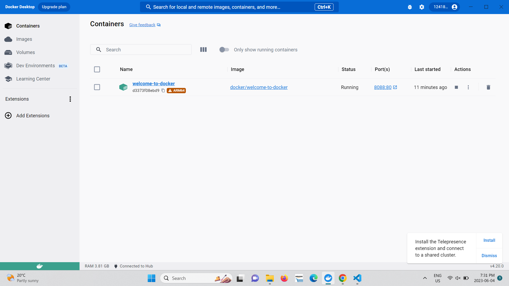

 Step-3

 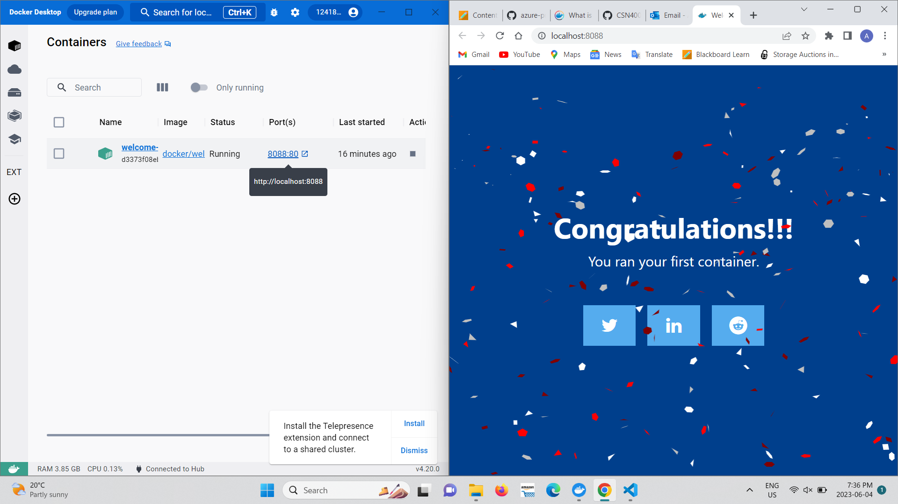

 Step-4

 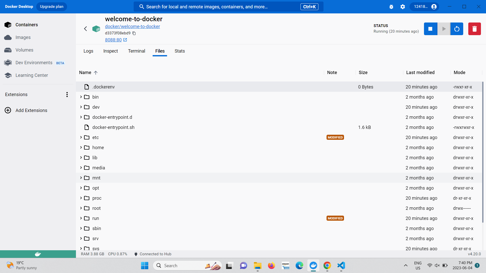

 Step-5

 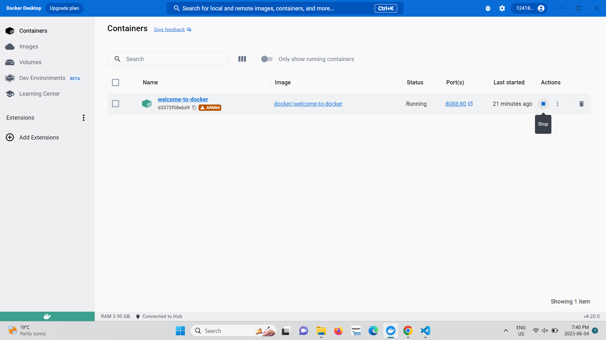

##  Part B - Run Your own container
#

Step1

 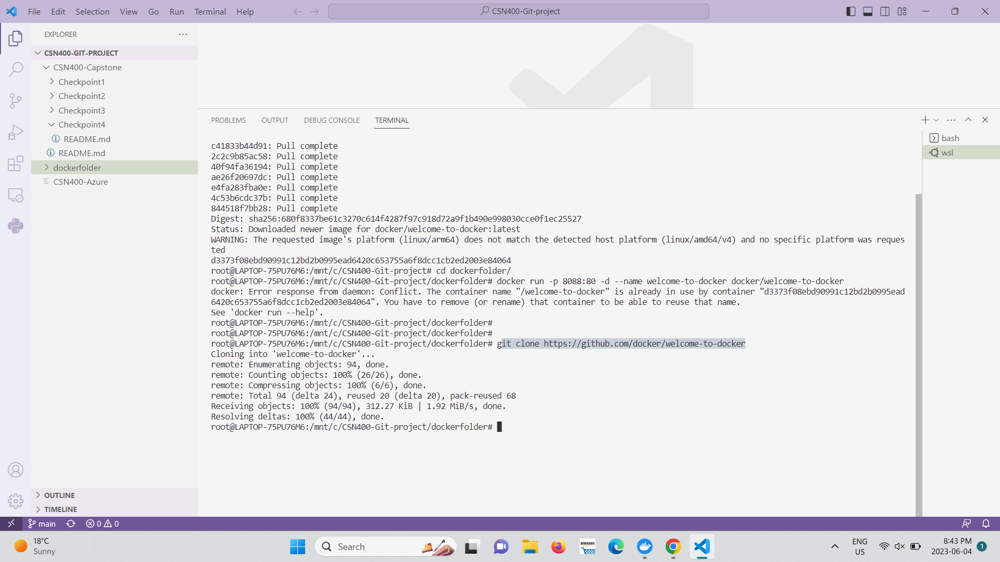

 Step-2

 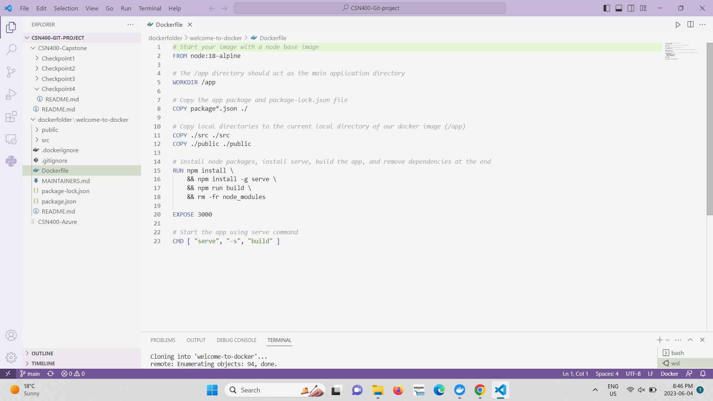

 Step-3

 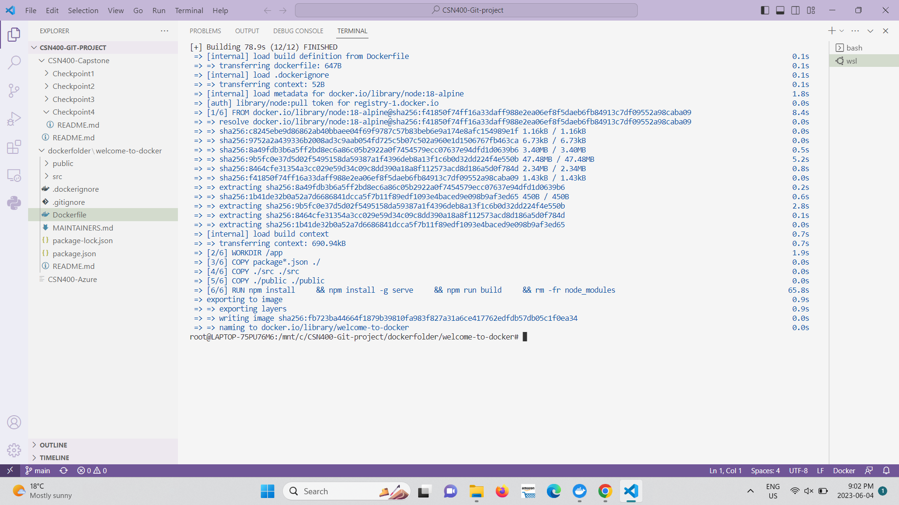

 Step-4

 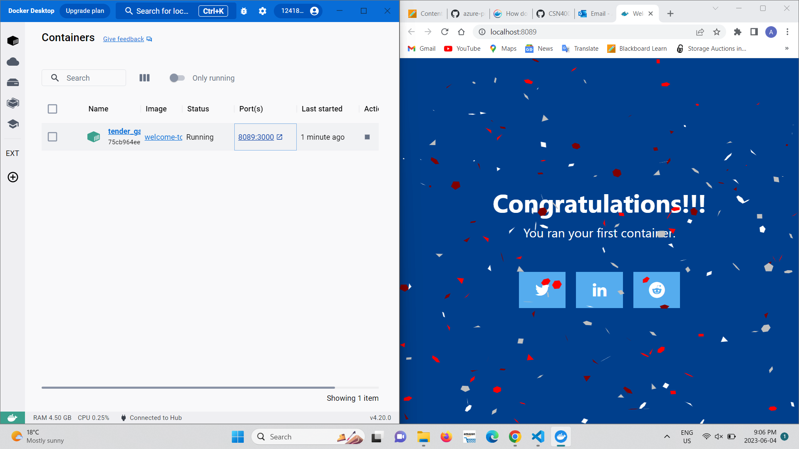

##  Part C - Run Docker Hub Image
#

Step1

 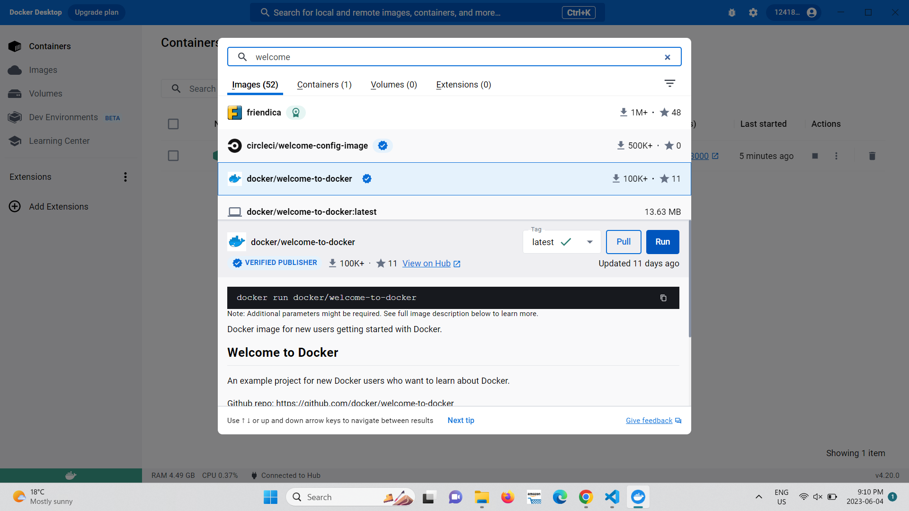

 Step-2

 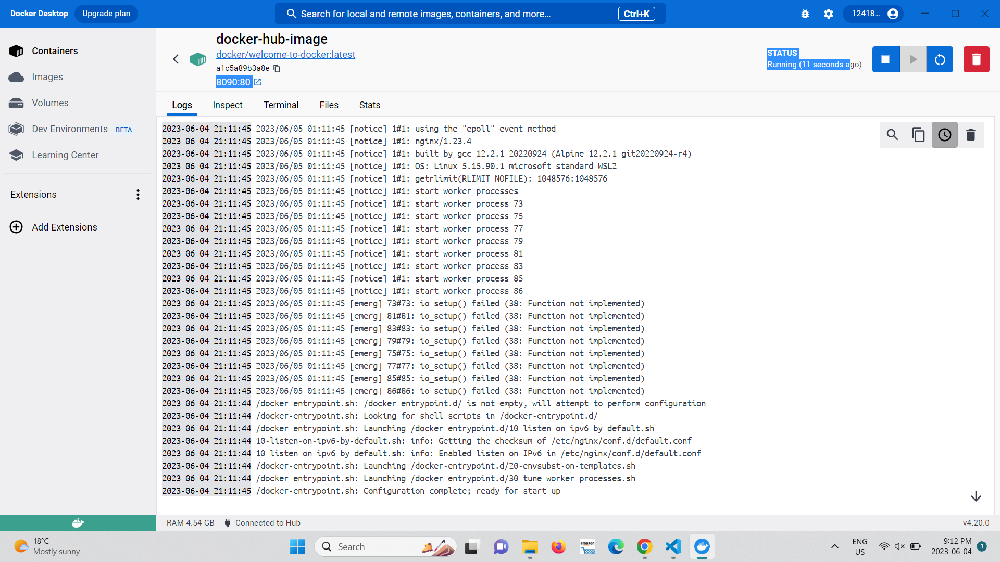

 Step-3

 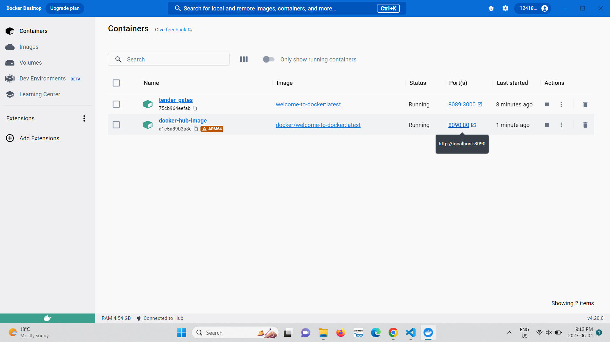

##  Part D - Publish your images
#
