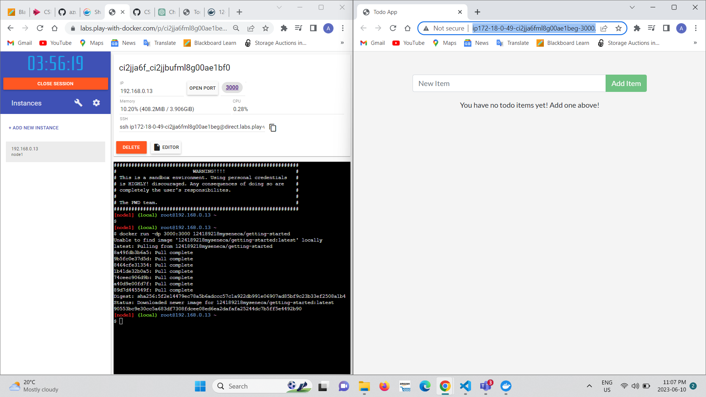

# Checkpoint5 Submission

- **COURSE INFORMATION: CSN400NDD**
- **STUDENT’S NAME: Ashwin Dhingra**
- **STUDENT'S NUMBER: 124189218**
- **GITHUB USER ID: 124189218-myseneca**
- **TEACHER’S NAME: Atoosa Nasiri**


### Table of Contents
1. [Part A - Containerize an application](#Part-A--Containerize-an-application)
2. [Part B - Share the application](#Part-B--Share-the-application)
3. [Part C - Persist the DB](Part-C--Persist-the-DB)
4. [Part D - Multi container apps](#Part-D--Multi-container-apps)


## ✨ Part A - Containerize an application

- **Question1:** If you run `docker build -t getting-started .` for a second time, the build time will be different from first time, why? Why the number of steps are also different? Explain your answers in detail.
- **Question2:** What does `-t` flag do? If you do not use it what is the error? embed the error in your answer.
- **Question3:** Run `docker build -t getting-started .` a few times and then run `docker image ls` to get the list of your images, why do you still one image listed even though you have tried building image many times?


- **Question4:** What are `-d` and `-p` flags? What does each flag do? Start another `git bah` or `wsl` terminal and run `docker run -p 1000:3000 getting-started`in it, Notice that `-d` is missing. What is the output?Embed it in your submission. Explain why this happened? 
- **Question5:** The previous question has created a new container with your app running in it. Which port in localhost must be used to reach it? 
- **Question6:** Run `docker ps` and embed the output in your answer. If you have completed previous questions, you should have at least two containers running in your system. What is their difference? Can you explain how and why this was necessary?

- **Question7:** How long did it take to create the image after you updated the code? It is still shorter than the first time you did it, why?
- **Question8:** What is the error message you get when you try to run the app container? Embed the error in your submission and explain why do you get this error at all?
- **Question9:** Repeat all the step for app update for: `<p className="text-center">What tasks no to do for CSN400 yet! Add one above!</p>` and embed a screenshot of your app in your submission.

#

## ✨ Part B - Share the application

### DockerHub 

 
 
 ### Port number and deployed app

 


#

## ✨ Part C - Persist the DB

### output of docker volume inspect todo-db
```bash
[
    {
        "CreatedAt": "2023-06-11T22:30:25Z",
        "Driver": "local",
        "Labels": null,
        "Mountpoint": "/var/lib/docker/volumes/todo-db/_data",
        "Name": "todo-db",
        "Options": null,
        "Scope": "local"
    }
]
```
#

## ✨ Part D - Multi container apps

### mysql> SHOW DATABASES;
```bash
mysql> show databases;
+--------------------+
| Database           |
+--------------------+
| information_schema |
| mysql              |
| performance_schema |
| sys                |
| todos              |
+--------------------+
5 rows in set (0.00 sec)
```

### dig mysql
```bash
2c7d5baf3b7e  ~  dig mysql

; <<>> DiG 9.18.13 <<>> mysql
;; global options: +cmd
;; Got answer:
;; ->>HEADER<<- opcode: QUERY, status: NOERROR, id: 46559
;; flags: qr rd ra; QUERY: 1, ANSWER: 1, AUTHORITY: 0, ADDITIONAL: 0

;; QUESTION SECTION:
;mysql.                         IN      A

;; ANSWER SECTION:
mysql.                  600     IN      A       172.18.0.2

;; Query time: 0 msec
;; SERVER: 127.0.0.11#53(127.0.0.11) (UDP)
;; WHEN: Sun Jun 11 22:53:53 UTC 2023
;; MSG SIZE  rcvd: 44
```

### mysql> SELECT * from todo_items;
```bash
mysql> select * from todo_items;
+--------------------------------------+----------------+-----------+
| id                                   | name           | completed |
+--------------------------------------+----------------+-----------+
| 98b7bbde-10c6-4eab-a68a-6063bf2ace49 | repository     |         0 |
| eee06b80-44a6-49f5-8e07-f7960ce0306a | butter chicken |         0 |
| da3e5988-2e64-439c-af87-647dc63e36c0 | Taxes          |         0 |
+--------------------------------------+----------------+-----------+
3 rows in set (0.00 sec)
```