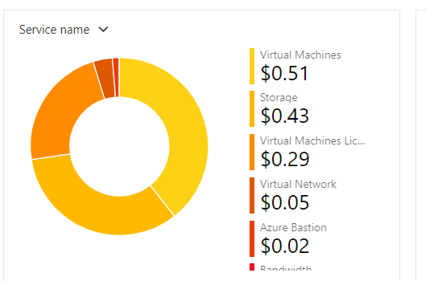

# Checkpoint7 Submission

- **COURSE INFORMATION: CSN400NDD**
- **STUDENT’S NAME: Ashwin Dhingra**
- **STUDENT'S NUMBER: 124189218**
- **GITHUB USER ID: 124189218-myseneca**
- **TEACHER’S NAME: Atoosa Nasiri**

### Table of Contents

1. [Part A - Creating & Configuring VMs - Using Portal](#Part-A---Creating-&-Configuring-VMs---Using-Portal)
2. [Part B - Basic Connectivity - VM Configuration](#Part-B---Basic-Connectivity---VM-Configuration)
3. [Part C - Enable IP_Forwarding - Using Portal](#Part-C---Enable-IP_Forwarding---Using-Portal)
4. [Part D - Creating & Configuring VM Images - Using Portal](#Part-D---Creating-&-Configuring-VM-Images---Using-Portal)
5. [Part E - Azure Cost Analysis Charts](#Part-E---Azure-Cost-Analysis-Charts)
6. [Part F - Create Customized Azure Dashboard](#Part-F---Create-Customized-Azure-Dashboard)


## Part A - Creating & Configuring VMs - Using Portal
```
1. What is the difference between Windows machine NSG and Linux machine NSG rules? Why? **Do not give screenshots** just describe the difference? Do you need a rule for `ssh` or `rdp`? What happens if you delete specific `ssh` and `rdp` rules?

Answer - The main distinction between Linux and Windows machines' NSG rules NSG rules are found in particular protocols and ports that are frequently connected to each operating system. for examples some commonly used protocols in windows os is TCP, UDP and RDP whereas SSH is most common in linux.

We need the 'ssh' or 'rdp' to remotely connect to a linux or a windows machine. Deleting these protocols, no connection can be established as the machine will block all the corresponding ssh or rdp traffic.

2. Work from Azure Bash CLI in **Portal** to get a list of your VM, NSG, NIC, and Disks. You can start with the below commands. Make sure the outputs in table format are embedded in your submission.
Answer - 

odl_user [ ~ ]$ az group list --output table
Name               Location       Status
-----------------  -------------  ---------
Bastion_RG         canadacentral  Succeeded
NetworkWatcherRG   canadacentral  Succeeded
Student-RG-954430  canadacentral  Succeeded

2. odl_user [ ~ ]$ az vm list -g $RG -o table
Name    ResourceGroup      Location       Zones
------  -----------------  -------------  -------
LR-106  Student-RG-954430  canadacentral  1
LS-106  Student-RG-954430  canadacentral  1
WC-106  Student-RG-954430  canadacentral  1
WS-106  Student-RG-954430  canadacentral  1

3. odl_user [ ~ ]$ az network nic list -g $RG -o table
EnableAcceleratedNetworking    EnableIPForwarding    Location       MacAddress         Name          NicType    Primary    ProvisioningState    ResourceGroup      ResourceGuid                          VnetEncryptionSupported
-----------------------------  --------------------  -------------  -----------------  ------------  ---------  ---------  -------------------  -----------------  ------------------------------------  -------------------------
False                          False                 canadacentral  60-45-BD-61-48-DC  lr-106715_z1  Standard   True       Succeeded            Student-RG-954430  58e3c230-0ef4-471e-a12d-300354d7b07b  False
False                          False                 canadacentral  00-22-48-B2-58-10  ls-106838_z1  Standard   True       Succeeded            Student-RG-954430  42b48c2b-777c-4b33-a87b-02ad2fbe08ab  False
False                          False                 canadacentral  60-45-BD-60-55-EB  wc-106979_z1  Standard   True       Succeeded            Student-RG-954430  c3a8cfe5-efee-4c88-973e-e025fc8448cf  False
False                          False                 canadacentral  00-22-48-3E-6B-A7  ws-106510_z1  Standard   True       Succeeded            Student-RG-954430  d1ba5662-f10a-470a-8f7d-a521066964a7  False
odl_user [ ~ ]$ 

3. odl_user [ ~ ]$ az network nsg list --output table
Location       Name        ProvisioningState    ResourceGroup      ResourceGuid
-------------  ----------  -------------------  -----------------  ------------------------------------
canadacentral  LR-106-nsg  Succeeded            Student-RG-954430  bf45c76b-a2b5-4458-bf0b-47dff17e8710
canadacentral  LS-106-nsg  Succeeded            Student-RG-954430  65fd83f5-ce89-493a-a1f8-1a9b06601583
canadacentral  WC-106-nsg  Succeeded            Student-RG-954430  7b188fca-d172-4046-8eef-f7c64c2fd210
canadacentral  WS-106-nsg  Succeeded            Student-RG-954430  0fccb41f-ca4f-4935-bdc7-096d125cd66c


4. odl_user [ ~ ]$ az disk list --output table
Name                                              ResourceGroup      Location       Zones    Sku           OsType    SizeGb    ProvisioningState
------------------------------------------------  -----------------  -------------  -------  ------------  --------  --------  -------------------
LR-106_OsDisk_1_82ff7405a20841d0863ab90b51c37d71  STUDENT-RG-954430  canadacentral  1        Standard_LRS  Linux     64        Succeeded
LS-106_disk1_3548cb66b134472796a333b31012eb45     STUDENT-RG-954430  canadacentral  1        Standard_LRS  Linux     64        Succeeded
WC-106_OsDisk_1_4849841c854d499895fba484e9d8e9eb  STUDENT-RG-954430  canadacentral  1        Standard_LRS  Windows   127       Succeeded
WS-106_OsDisk_1_66b80678095246b585c2e4fb97474627  STUDENT-RG-954430  canadacentral  1        Standard_LRS  Windows   127       Succeeded


```


## Part B - Enable IP_Forwarding - Using Portal
```
1. Check the status of ip-forwarding using the command az network nic ip-config show with output format as json. Include only the command not output including the --quey you used in your submission.
Asnwer - az network nic ip-config show --name ipconfig1 --nic-name lr-106715_z1 --resource-group Student-RG-954430 --query "{IPForwarding: IPForwarding}" --output json

2 .When your output format is json, which property shows the status of the ip-forwarding attribute? Embed only the property that shows the status of ip-forwarding.
Answer -  
{
  "IPForwarding": null
}

Check if the IP forwarding in NIC is enabled using Azure bash. 👉 Hint: az network nic show -g <rg-name> -n <nic-name> --query "enableIpForwarding"
```
## Part C - Basic Connectivity - VM Configuration
```
1. In configuring your Linux VMs, for the step "Remove the firewalld service", which command will you be using?
In configuring your Linux VMs, what command do you use to check the status of iptabels?
answer - sudo apt remove firewalld


2. How can you make iptables service start automatically after reboot on CenOS/RHEL8? 👉 Hint: RHEL7: How to disable Firewalld and use Iptables instead

3.Run a command in LR-xx that shows all iptables chains with their order number. What is the default setting? Include both the command and its output in your submission. How could you improve these settings to be less vulnerable to attacks?

4. Run a command that shows the hostname in LR-XX and LX-XX. Embed the output in your submission.

```

## Part D - Creating & Configuring VM Images - Using Portal


## Part E - Azure Cost Analysis Charts

| No. | Scope | Chart Type | VIEW Type |  Date Range | Group By | Granularity| Example |
|-|-|-|-|-|-|-|-|
|1|Student-RG-954430| Column (Stacked) | DailyCosts | Last 7 Days | Resource | Daily |  alt="Daily Cost Barchart" style="float: left; margin-right: 10px;" /> |
|2|Student-RG-954430| Column (Stacked) | DailyCosts | Last 7 Days | Service | Daily |  |
|3|Student-RG-954430| Area| AccumulatedCosts | Last 7 Days | Resource | Accumulated |  |
|4|Student-RG-954430| Pie Chart | NA | Last Month | Service Name | NA |  |
|5|Student-RG-954430| Pie Chart | NA | Last Month | Service Family | NA |  |
|6|Student-RG-954430| Pie Chart | NA | Last Month | Product | NA |  |


## Part F - Create Customized Azure Dashboard

