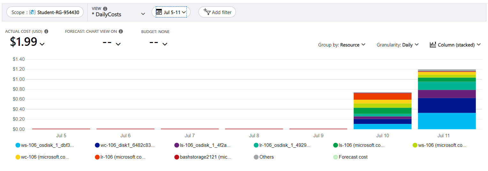
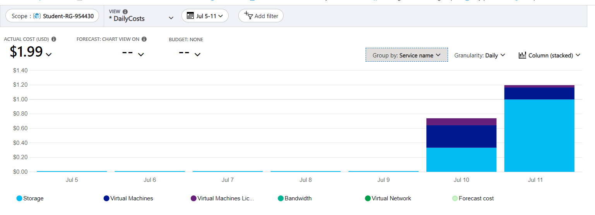
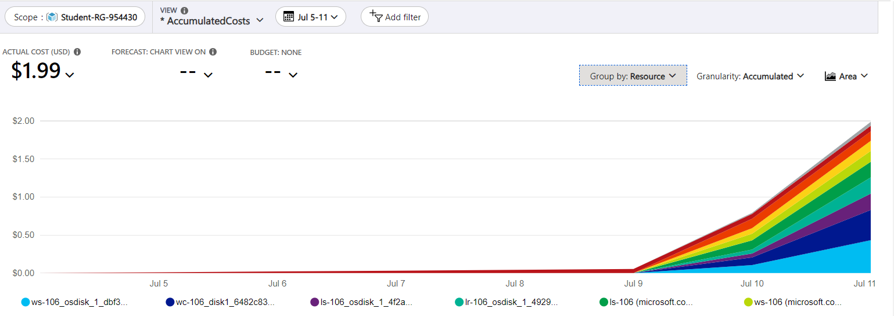
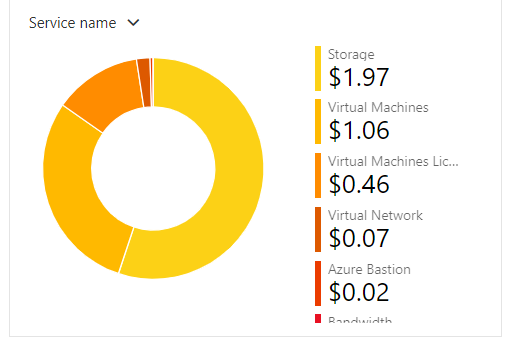
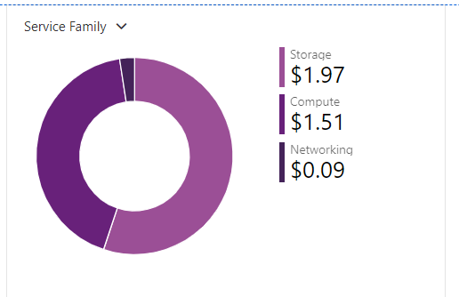
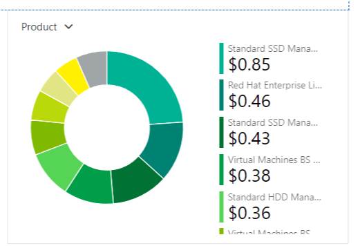

# Checkpoint8 Submission

- **COURSE INFORMATION: CSN400NDD**
- **STUDENT’S NAME: Ashwin Dhingra**
- **STUDENT'S NUMBER: 124189218**
- **GITHUB USER ID: 124189218-myseneca**
- **TEACHER’S NAME: Atoosa Nasiri**

### Table of Contents

1. [Part A - Creating & Configuring VMs - Using Azure CLI Scripts](#Part-A---Creating-&-Configuring-VMs---Using-Azure-CLI-Scripts)
2. [Part B - Basic Connectivity - Linux VMs Firewall Setting](#Part-B---Basic-Connectivity---Linux-VMs-Firewall-Setting)
3. [Part C - Azure Cost Analysis Charts](#Part-C---Azure-Cost-Analysis-Charts)


## Part A - Creating & Configuring VMs - Using Azure CLI Scripts
```

1. Get a list of your VM, NSG, NIC, and Disks using Azure CLI in table format. Do not include screenshots, just embed the output in table format in your submission.
Answer - 
vm list -

Name    ResourceGroup      Location       Zones
------  -----------------  -------------  -------
LR-106  STUDENT-RG-954430  canadacentral
LS-106  STUDENT-RG-954430  canadacentral
WC-106  STUDENT-RG-954430  canadacentral
WS-106  STUDENT-RG-954430  canadacentral

-------------

NSG list - 

Location       Name        ProvisioningState    ResourceGroup      ResourceGuid
-------------  ----------  -------------------  -----------------  ------------------------------------
canadacentral  LR-NSG-106  Succeeded            Student-RG-954430  0eddb5ad-3697-409e-bbaf-9a292266766d
canadacentral  LS-NSG-106  Succeeded            Student-RG-954430  7eec2378-ce83-46b5-9645-130d909a080f
canadacentral  WC-NSG-106  Succeeded            Student-RG-954430  5e9326d8-914c-46ab-83f5-6a3d342bf457
canadacentral  WS-NSG-106  Succeeded            Student-RG-954430  49b35b54-fe06-4bb5-bb1b-5d33991e6454

----------

NIC list - 

EnableAcceleratedNetworking    EnableIPForwarding    Location       MacAddress         Name    NicType    Primary    ProvisioningState    ResourceGroup      ResourceGuid                          VnetEncryptionSupported
-----------------------------  --------------------  -------------  -----------------  ------  ---------  ---------  -------------------  -----------------  ------------------------------------  -------------------------
False                          False                 canadacentral  60-45-BD-5D-09-BB  lr-106  Standard   True       Succeeded            Student-RG-954430  70cdc1ef-b104-422d-bed3-1e703180cf24  False
False                          False                 canadacentral  60-45-BD-5D-59-2A  ls-106  Standard   True       Succeeded            Student-RG-954430  9bc69187-88fe-4999-bcc7-2399cbe09877  False
False                          False                 canadacentral  60-45-BD-5F-9A-22  wc-106  Standard   True       Succeeded            Student-RG-954430  c87a7dc6-2a2d-4776-b073-461fe7532163  False
False                          False                 canadacentral  60-45-BD-60-C6-A1  ws-106  Standard   True       Succeeded            Student-RG-954430  611b4461-dfe6-42d8-8df1-376fe698a63a  False


---------

disk list 

Name                                              ResourceGroup      Location       Zones    Sku              OsType    SizeGb    ProvisioningState
------------------------------------------------  -----------------  -------------  -------  ---------------  --------  --------  -------------------
LR-106_OsDisk_1_4929ed23e4c54a7fad658210fa23a4a7  STUDENT-RG-954430  canadacentral           StandardSSD_LRS  Linux     64        Succeeded
LS-106_OsDisk_1_4f2a73d3cafa4f4697bffadd12c1e475  STUDENT-RG-954430  canadacentral           StandardSSD_LRS  Linux     64        Succeeded
WC-106_disk1_6482c834f86d4043bad936ad12739a6a     STUDENT-RG-954430  canadacentral           StandardSSD_LRS  Windows   127       Succeeded
WS-106_OsDisk_1_dbf3d33dc7a045638f89d0d057fe5d15  STUDENT-RG-954430  canadacentral           StandardSSD_LRS  Windows   127       Succeeded


2. Why are you creating NIC separate from VM? What happens when you delete a VM, is that attached NIC automatically deleted? Why?
answer 2 - Deleting a NIC is optional, while the VM is being created, we can choose to get the NIC deleted as the VM is deleted. This can be done if the NIC is not required anymore and it helps in maintaining a oraganised and clean environment.

However, NIC can be saved from deletion if choosen so, they can reused in future VMs if similar network configurations are required.

3.When you created VMs from Portal can you use an existing NIC? Do you consider this a limitation in working from Portal for VM creation?
answer 3- Azure offer an ease create or choose form existing NIC while creating a Vm. It offers extensive options for managing and creating resources and consideriing all those calling exiting NIC usage a limitation could be inaccurate.

4. What rules did we add to Network Security Groups (NSG)? What does each rule do?
answer - There three defined rules - AllowVnetInBound,DenyAllInBound and AllowAzureLoadBalancerInBound

This rule successfully filters out all incoming network traffic that does not comply with any of the rules that came before it. The "DenyAll" rule, which provides a default refuse behaviour for unmatched traffic and prevents unauthorised access, is frequently seen at the conclusion of a security rule list.

This rule successfully filters out all incoming network traffic that does not comply with any of the rules that came before it. The "DenyAll" rule, which provides a default refuse behaviour for unmatched traffic and prevents unauthorised access, is frequently seen at the conclusion of a security rule list.


5. Run a command in CLI that lists all your Custom Images. Change the output format to table format and embed the answer in your submission.

Name    ResourceGroup      Location       Zones
------  -----------------  -------------  -------
LR-106  STUDENT-RG-954430  canadacentral
LS-106  STUDENT-RG-954430  canadacentral
WC-106  STUDENT-RG-954430  canadacentral
WS-106  STUDENT-RG-954430  canadacentral

-------------

6. Delete your VMs using the proper script after your work is completed. Run a command in CLI that lists all your VMs.

7.Get a list of your VM, NSG, NIC, and Disks using Azure CLI in table format. Which ones are empty? Do not include screenshots, just embed the output in table format in your submission.


```
## Part B - Basic Connectivity - Linux VMs Firewall Setting
```
Run commands that show the status of the Apache server and MariDB server in your LS-xx. Embed the output as a bash snippet.
Run a command in LR-xx that show iptables chains. What is the default setting? How could you improve these settings to be less vulnerable to attacks?

Attached file lr_iptables - 


Run a command that shows the hostname in LR-XX and LX-XX and embed the output in your submission.
Submit your lr_iptables.txt and ls_iptables.txt files. Do not embed them in your README.md, just add it in your folder and give a hyperlink.

Attached file lr_iptables - 

Test your firewall settings and your configurations for basic ssh and rdp connectivity between your Desktop Client and Linux Server LS-xx and Windows Server WS-xx a few times.

```

## Part C - Azure Cost Analysis Charts

# Azure Cost Analysis Charts


| No. | Scope | Chart Type | VIEW Type |  Date Range | Group By | Granularity| Example |
|-|-|-|-|-|-|-|-|
|1|Student-RG-954430| Column (Stacked) | DailyCosts | Last 7 Days | Resource | Daily |  |
|2|Student-RG-954430| Column (Stacked) | DailyCosts | Last 7 Days | Service | Daily |  |
|3|Student-RG-954430| Area| AccumulatedCosts | Last 7 Days | Resource | Accumulated |  |
|4|Student-RG-954430| Pie Chart | NA | Last Month | Service Name | NA |  |
|5|Student-RG-954430| Pie Chart | NA | Last Month | Service Family | NA |  |
|6|Student-RG-954430| Pie Chart | NA | Last Month | Product | NA |  |
