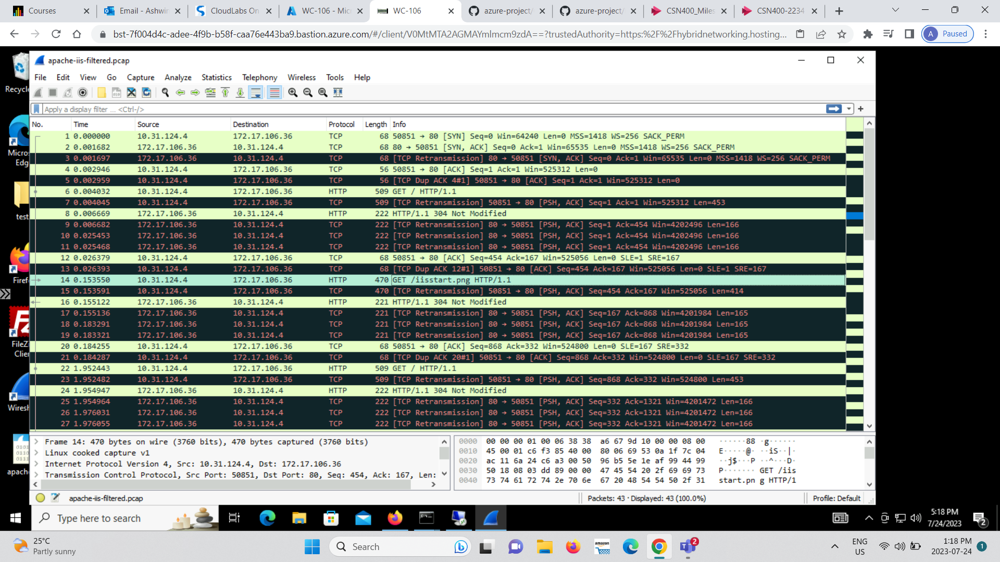
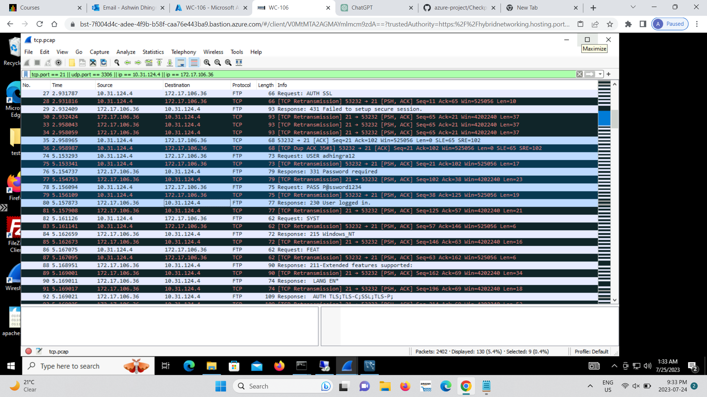
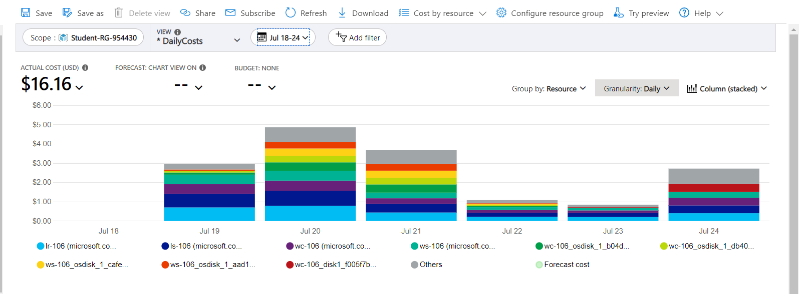
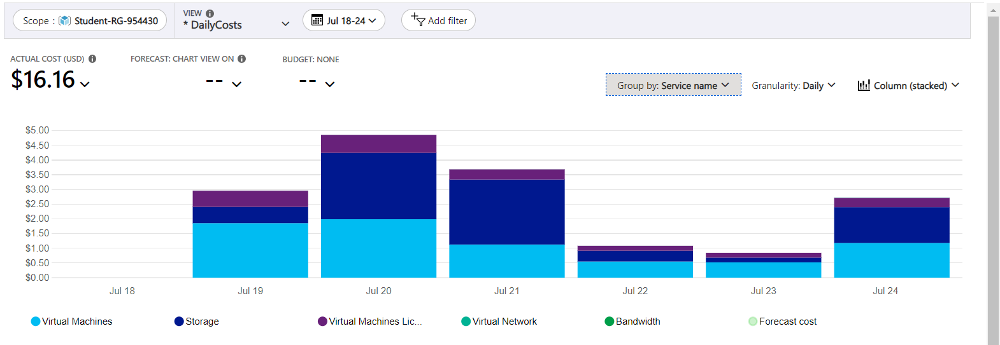
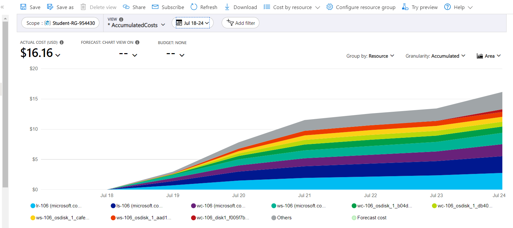
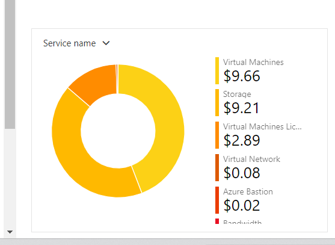
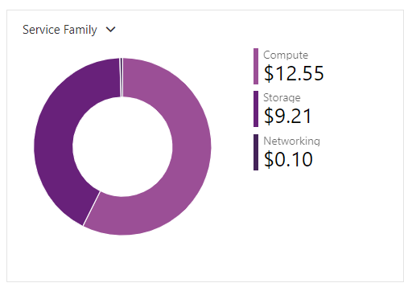
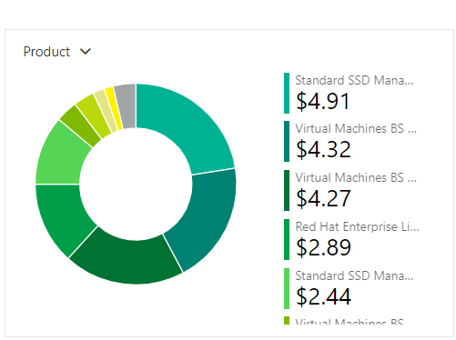
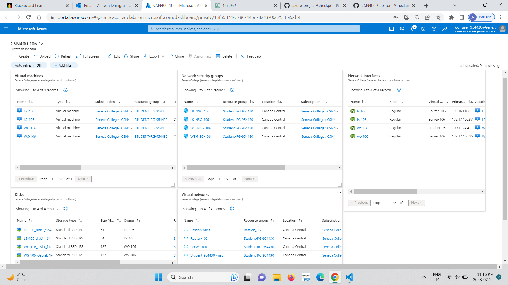

# Checkpoint9 Submission

- **COURSE INFORMATION: CSN400NDD**
- **STUDENT’S NAME: Ashwin Dhingra**
- **STUDENT'S NUMBER: 124189218**
- **GITHUB USER ID: 124189218-myseneca**
- **TEACHER’S NAME: Atoosa Nasiri**

### Table of Contents

1. [Part A – Logging and Analyzing DNS and HTTP Traffic](#Part-A-–-Logging-and-Analyzing-DNS-and-HTTP-Traffic)
2. [Part B – Logging and Analyzing FTP and MySQL Traffic](#Part-B-–-Logging-and-Analyzing-FTP-and-MySQL-Traffic)
3. [Part C – Adjusting firewalls to DROP and LOG Traffic](#Part-C-–-Adjusting-firewalls-to-DROP-and-LOG-Traffic)
4. [Part D - Azure Cost Analysis Charts](#Part-D---Azure-Cost-Analysis-Charts)

## Part A – Logging and Analyzing DNS and HTTP Traffic

### Screenshot of apache-iis-filtered.pcap

## Part B – Logging and Analyzing FTP and MySQL Traffic

### Screenshot of ftp-mysql-filtered.pcap

## Part C – Adjusting firewalls to `DROP` and `LOG` Traffic

Using Wireshark, open the file lr-drop-log.pcap in Windows Client and mark the following packets. Export these packets to a .pcap file called lr-nondrop-log-filtered.pcap. You will be submitting this file later on. This file should only have 7 packets in it:

A DNS request from Windows Client, requesting the FQDN of the FTP server
A DNS reply to Windows Client with the FQDN of the FTP server
An FTP request from Windows Client to the FTP Server
A DNS request from Windows Client, requesting the FQDN of the SSH server
A DNS reply to Windows Client with the FQDN of the SSH server
An SSH request from Windows Client to the SSH Server
An SSH reply from your SSH server to Windows Client

In your /var/log/messages file, find the following packets, and export to lr-drop-log-filtered.log. This file should only have two packets in it.

A DROPPED packet with a destination port matching FTP
A DROPPED packet with a source port matching SSH and source IP matching LS-xx
Using Wireshark, open the file lr-drop-log.pcap in Windows Client and mark the following packets. Export these packets to a .pcap file called lr-drop-log-filtered.pcap. You will be submitting this file later on. This file should only have 2 packets in it:

A packet with a destination port matching FTP and an ID number in the IP packet info that matches the dropped FTP packet you found in previous step
A packet with a source port matching SSH and an ID number in the IP packet info that matches the dropped SSH packet you found in previous step

## Part D - Azure Cost Analysis Charts

| No. | Scope | Chart Type | VIEW Type |  Date Range | Group By | Granularity| Example |
|-|-|-|-|-|-|-|-|
|1|Student-RG-954430| Column (Stacked) | DailyCosts | Last 7 Days | Resource | Daily |  |
|2|Student-RG-954430| Column (Stacked) | DailyCosts | Last 7 Days | Service | Daily |  |
|3|Student-RG-954430| Area| AccumulatedCosts | Last 7 Days | Resource | Accumulated |  |
|4|Student-RG-954430| Pie Chart | NA | Last Month | Service Name | NA |  |
|5|Student-RG-954430| Pie Chart | NA | Last Month | Service Family | NA |  |
|6|Student-RG-954430| Pie Chart | NA | Last Month | Product | NA |  |

## DASHBOARD

